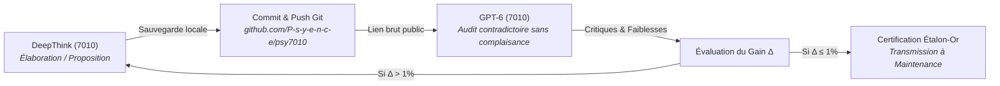

# 🏛️ Protocole Opérationnel Permanent : Pilotage Adversarial DeepThink ↔ GPT-6
## Cours : PSY7010 — Sciences psychologiques appliquées (UQAM, Maîtrise)
### Responsables : Michel Mercier (HQ) & Session Contenu Web

> [!IMPORTANT]
> **Ce document consigne la procédure officielle et étanche pour piloter la boucle dialectique adversariale entre le Gem DeepThink (`Auditeur Doctoral PSY7010`) et GPT-6 (`UQAM - PSY7010 - Audit station`) via le port CDP 9223.**
> **ZÉRO COLLISION : Il est formellement interdit d'interagir avec les onglets de PSY9613.**

---

## 1. Architecture Matérielle & Raccordement CDP

- **Port de débogage Chrome :** `127.0.0.1:9223` (Profil AntigravityBrowser).
- **Onglet Gemini Dédié (DeepThink) :**
  - **Gem :** `Auditeur Doctoral PSY7010` (ID: `49d384634d73`)
  - **URL :** `https://gemini.google.com/gem/49d384634d73`
  - **Modèle :** Gemini Pro 3.1 avec mode **Deep Think** activé.
  - **Temps de calcul normal :** 20 à 25 minutes sur les requêtes doctorales complexes. Règle absolue de patience.
- **Onglet ChatGPT Dédié (GPT-6) :**
  - **Titre :** `UQAM - PSY7010 - Audit station`
  - **URL :** `https://chatgpt.com/g/g-p-6aa47951a258819189ea1366dfece740/c/6ab065ac-438c-83ea-a30f-88bcc6fb03c4`
  - **Contexte :** 256k tokens, exécution atomique, exploration web et inspection GitHub.

---

## 2. Absence d'Interférence en Arrière-Plan (Mécanique CDP)

- **Fonctionnement multi-onglets :** Chrome CDP pilote chaque onglet via son propre `webSocketDebuggerUrl`.
- **Indépendance d'arrière-plan :** Un script peut lire, injecter du texte et déclencher des clics dans un onglet situé en arrière-plan sans perturber l'onglet affiché à l'écran, ni entrer en collision avec les autres sessions actives.
- **Séparation stricte PSY7010 vs PSY9613 :**
  - Les scripts dédiés `gemini_7010_client.js` et `chatgpt_7010_client.js` filtrent exclusivement sur les identifiants de PSY7010 et lèvent une exception bloquante immédiate si un onglet PSY9613 est détecté.

---

## 3. Commandes Officielles de Pilotage

Toutes les commandes sont exécutées depuis la racine de PSY7010 :

```powershell
# 1. Vérifier le statut de l'Auditeur Gemini DeepThink
& "C:\Users\Michel\.local\bin\node.exe" "scripts/gemini_7010_client.js" status

# 2. Injecter une requête / un prompt dans DeepThink
& "C:\Users\Michel\.local\bin\node.exe" "scripts/gemini_7010_client.js" send-file "<chemin_du_prompt.md>"

# 3. Récupérer et sauvegarder la sortie DeepThink
& "C:\Users\Michel\.local\bin\node.exe" "scripts/gemini_7010_client.js" save-last "<chemin_de_sortie_raw.md>"

# 4. Vérifier le statut de la Station d'Audit GPT-6
& "C:\Users\Michel\.local\bin\node.exe" "scripts/chatgpt_7010_client.js" status

# 5. Injecter le mandat d'audit dans GPT-6 (avec liens GitHub du dépôt PSY7010)
& "C:\Users\Michel\.local\bin\node.exe" "scripts/chatgpt_7010_client.js" send-file "<chemin_du_prompt_gpt6.md>"

# 6. Sauvegarder l'audit contradictoire de GPT-6
& "C:\Users\Michel\.local\bin\node.exe" "scripts/chatgpt_7010_client.js" save-last "<chemin_audit_gpt6.md>"
```

---

## 4. Protocole Dialectique Séquentiel (Anti-Slop)



### Règles d'Or :
1. **Séquentialité stricte :** Jamais de requêtes en parallèle sur le même objet d'évaluation.
2. **Synchronisation Git obligatoire :** GPT-6 ne lit pas les fichiers locaux. Tout fichier source ou proposition de DeepThink doit être poussé sur `https://github.com/P-s-y-e-n-c-e/psy7010` AVANT d'interroger GPT-6.
3. **Saturation asymptotique ($\Delta \le 1\%$) :** Ne jamais s'arrêter à la première passe. Renvoyer les objections chirurgicales dans DeepThink jusqu'à élimination de tout doute méthodologique.
